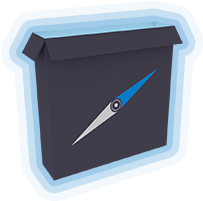

<p align="center"></p>

# nwjs-installer &middot;   [](LICENSE) 

`nwjs-installer` is a command-line utility written in [Node.js](https://nodejs.org/) that streamlines the process of preparing a [nw.js](https://nwjs.io/) distribution.

This utility is intended for use in automated build pipelines or for development and testing purposes.

- Supports all platforms, architectures and versions.
- Supports both production and SDK builds.
- Caches builds to avoid unnecessary downloads.
- Minimal external dependencies: [tar](https://www.npmjs.com/package/tar) and [JSZip](https://www.npmjs.com/package/jszip).

## Installation
```bash
npm install nwjs-installer -g
```

## Usage
```bash
Usage: nwjs [options]

Options:
  --help                Show this help message and exit.
  --target-dir          Specify a target directory to install to.
  --version             Specify a version to install (e.g 0.49.2)
  --sdk                 Install the SDK flavor instead of the normal flavor.
  --no-cache            Disable caching of downloaded builds.
  --clear-cache         Clears the cache of downloaded builds.
  --platform <string>   Override the platform to install for.
  --arch <string>       Override the architecture to install for.
  --exclude <pattern>   Exclude files matching the given pattern.
  --download-server     Override the default download server to use.
  --locale <a,b,c..>    Define which locales to include in the build (defaults: all).
  --remove-pak-info     Remove .pak.info files to reduce the size of the build.
```

## Documentation

- [Versions](#versions) - Specify a specific version of nw.js to install.
- [Target Directory](#target-directory) - Specify a target directory to install to.
- [Platform / Architecture](#platform--architecture) - Override the platform and architecture to install for.
- [Caching](#caching) - Cache downloaded builds to avoid unnecessary downloads.
- [Development Build (SDK)](#development-build-sdk) - Install the SDK flavor instead of the normal flavor.
- [Excluding Files](#excluding-files) - Exclude files from the build.
- [Download Server](#download-server) - Override the default download server to use.
- [Locales](#locale) - Automatically remove locale files that you won't use.
- [Remove .pak.info](#remove-pakinfo) - Remove .pak.info files to reduce the size of the build.

### Verions

Using the `--version <version>` option you can specify a specific version of nw.js to install. This should be a valid version number such as `0.49.2` or `0.48.0-beta1`.

```bash
nwjs --version 0.48.0-beta1
```
If no version is specified, the latest stable version will be installed. This is determined by querying the directory listing of the download server.

```bash
nwjs # No version, latest is installed.
```

### Target Directory

By default, nw.js will be installed in the current working directory. To specify your own target directory, use the `--target-dir` option.

```bash
nwjs --target-dir /path/to/target # Installs to /path/to/target.
```
Keep in mind that files will be overwritten if they already exist in the target directory.

The `--target-directory` option also supports some substitution variables that can be used to dynamically generate the target directory.


| Variable | Description | Example |
| -------- | ----------- | ------- |
| `{version}` | The version of nw.js being installed. | `0.49.2` |
| `{platform}` | The platform being installed for. | `win` |
| `{arch}` | The architecture being installed for. | `x64` |
| `{flavor}` | The flavor being installed. | `normal` |
| `{package}` | The name of the package being installed. | `nwjs-v0.49.2-win-x64` |

```bash
nwjs --target-dir="/{package}" # Installs to /nwjs-v0.49.2-win-x64
nwjs --sdk --target-dir="/{version}/{flavor}" # Installs to /0.49.2/sdk
```

### Platform / Architecture

By default, the platform and architecture of the current system will be used. If you wish to override this, use the `--platform` and `--arch` options.

```bash
nwjs --platform win --arch x64 # Installs latest stable build for Windows x64.
```

> *Note*: For compatibility with the Node.js API, the platform `win32` is treated as `win` and the platform `darwin` is treated as `osx`.

At the time of writing, the following platforms and architectures are supported:
| Platform | Architecture  |
| -------- | ------------- |
| `win`    | `x64`  `ia32` |
| `linux`  | `x64`  `ia32` |
| `osx`    | `x64`         |

This utility does not validate against this table, and will attempt to download the build regardless of the platform or architecture specified. If the build does not exist, the download will fail.

### Caching

By default, downloaded builds are cached to the operating system's temporary directory. Installing the same version multiple times will re-use the cached build, avoiding unnecessary downloads.

```js
Path: os.tmpdir() + '/nwjs-installer-cache/' + package
```

To disable this behavior, use the `--no-cache` option. The cache will not be checked or updated when this option is used.

```bash
nwjs --no-cache # Disables caching.
```

Additionally, the `--clear-cache` option can be used to clear the cache before a build starts. The cache will still be used unless `--no-cache` is also set.

```bash
nwjs --clear-cache # Clears the cache before installing.
```

### Development Build (SDK)

By default, the normal flavor of nw.js will be installed. If you wish to install the SDK flavor instead, use the `--sdk` option.

```bash
nwjs --sdk # Installs latest stable SDK build.
```

### Excluding Files

Providing the `--exclude <pattern>` option allows you to exclude files that match the pattern from the build. The pattern should be a valid [regular expression](https://developer.mozilla.org/en-US/docs/Web/JavaScript/Guide/Regular_Expressions).

```bash
nwjs --exclude "^credits.html$" # Excludes credits.html from the build.
nwjs --exclude "\.pak\.info$" # Excludes all .pak.info files from the build.
```

Notes on file exclusion:
- The pattern is matched against the file path as it appears inside the ZIP/TAR archive (minus the root directory), not the final file path on disk.
- To exclude `.pak.info` files more efficiently, see the [Remove .pak.info](#remove-pakinfo) section.
- To exclude locale files more efficiently, see the [Locales](#locale) section.

### Download Server

By default, the utility will use the [official download server](https://dl.nwjs.io/) when downloading builds. If you wish to use a different server, use the `--download-server` option.

```bash
nwjs --download-server https://example.com/
```

Notes on custom download servers:
- The server is expecting an Apache-style directory listing.
- Builds are scraped using `/<a href="v([^"]+)\/">v[^<]+\/<\/a>/g`
- Versions must match `/^(\d+)\.(\d+)\.(\d+)(-[a-z0-9]+)?$/`

### Locale

By default, builds come with locale files for [all languages supported by Chromium](https://chromium.googlesource.com/chromium/src/build/config/+/refs/heads/main/locales.gni). According to the [developer of nw.js](https://github.com/nwjs/nw.js/issues/2244#issuecomment-379977958), it is safe to remove locale files that you won't be using.

`nwjs-installer` makes this simple with the `--locale <locales>` option, where `<locales>` is a comma-separated list of locales to include.

You can find a list of locales supported by Chromium [here](https://chromium.googlesource.com/chromium/src/build/config/+/refs/heads/main/locales.gni).

```bash
nwjs --locale "sw,en-GB,en_US"
```

Notes on locale:
- You should use the locale IDs that Chromium uses, not platform-specific variations. For example, don't use `en` (OSX variation) for `en-US`, `nwjs-installer` will automatically adjust this when building for OSX.
- The locale files **are** not related to the language content of your application, it is related to the environment in which the application will be deployed. **Do not** exclude locale files unless you are 100% sure of the locale of the computers your application will be deployed onto.
- The use of hyphens and underscores differs between platforms, as such you can use either and `nwjs-installer` will automatically adjust them depending on the target platform (e.g `en-gb` == `en_gb`).
- Locale flags are case-insensitive (e.g `en-GB` == `en-gb`).

### Remove .pak.info

During the Chromium build process for Windows and Linux builds, a `.pak.info` file is generated for each `.pak` file in `/locales`. [Since 2018, CEF has been removing these files](https://bitbucket.org/chromiumembedded/cef/issues/2375) as part of their build script, but nw.js still includes them.

These files are not needed and can be safely removed. To help with this, `nwjs-installer` will automatically remove these if the `--remove-pak-info` option is used.

```bash
nwjs --remove-pak-info # Removes .pak.info files.
```

The `--remove-pak-info` is a more convinient and readable way of doing `--exclude "^locales\/([^.]+)\.pak\.info|$"` (see [Excluding Files](#excluding-files)) and skips OSX builds as they do not include these files.

## Contributing / Feedback / Issues
Feedback, bug reports and contributions are welcome. Please use the [GitHub issue tracker](https://github.com/Kruithne/nwjs-installer/issues) and follow the guidelines found in the [CONTRIBUTING](CONTRIBUTING.md) file.

## License
The code in this repository is licensed under the ISC license. See the [LICENSE](LICENSE) file for more information.